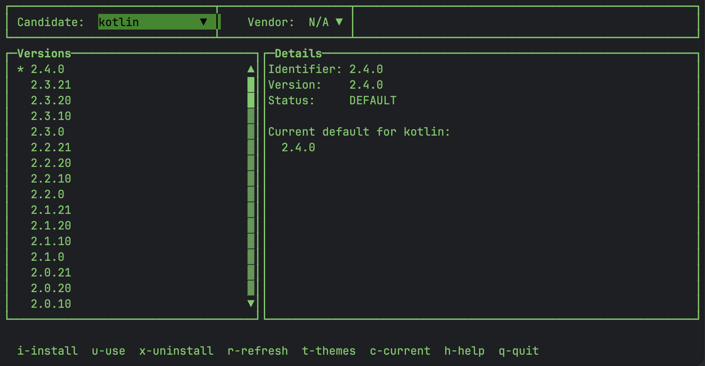

# sdkui

A terminal UI for managing SDKs with [SDKMAN!](https://sdkman.io) — browse, install, uninstall, and set defaults without leaving the terminal.



## Features

- Browse all SDKMAN candidates with version lists
- Filter versions by typing in the dropdown
- Install, uninstall, and set default versions
- Java vendor filtering (Temurin, Corretto, Zulu, etc.)
- Live progress log for install/uninstall operations
- View current installed versions (`c`)
- Multiple Lanterna themes (switch with `t`)
- Built-in help system (`h`)

## Requirements

- macOS with [SDKMAN!](https://sdkman.io) installed
- Java 25+

## Build & Run

```bash
./gradlew shadowJar
java -jar build/libs/sdkui.jar
```

## Keyboard Shortcuts

| Key | Action |
|-----|--------|
| `↑` / `↓` | Navigate versions |
| `i` | Install selected version |
| `u` | Set selected as default (`sdk use`) |
| `x` | Uninstall selected version |
| `c` | Show current installed versions |
| `r` | Refresh versions |
| `t` | Open theme chooser |
| `h` | Show help |
| `Esc` | Close overlay |
| `q` | Quit |

## Version Status

- `*` — current default
- `+` — installed (not default)
- plain — available (not installed)
